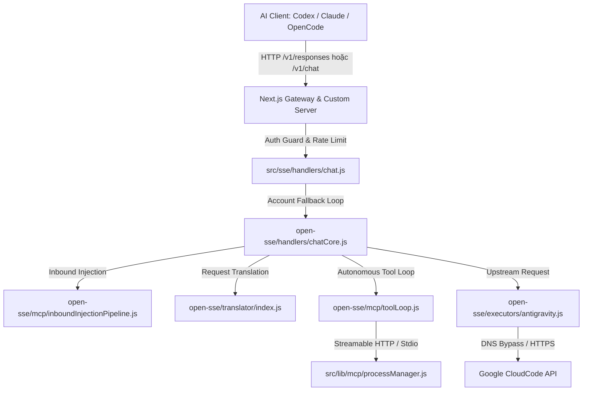
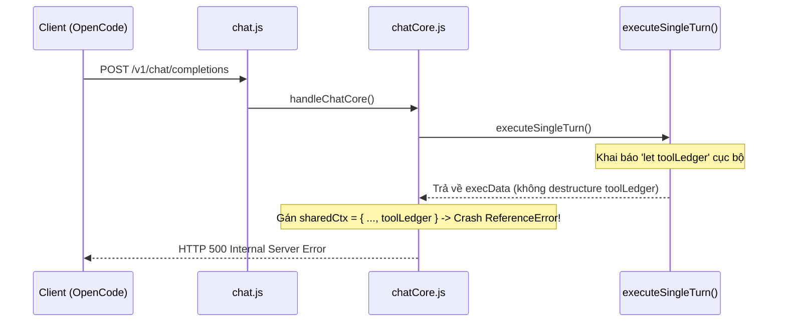
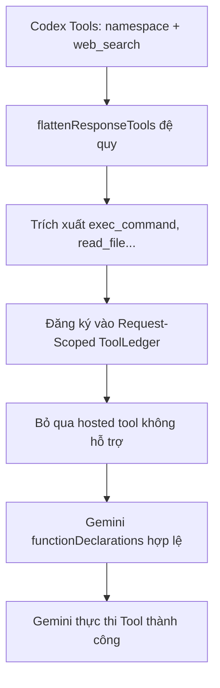
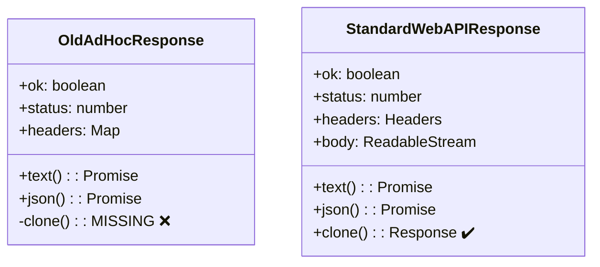
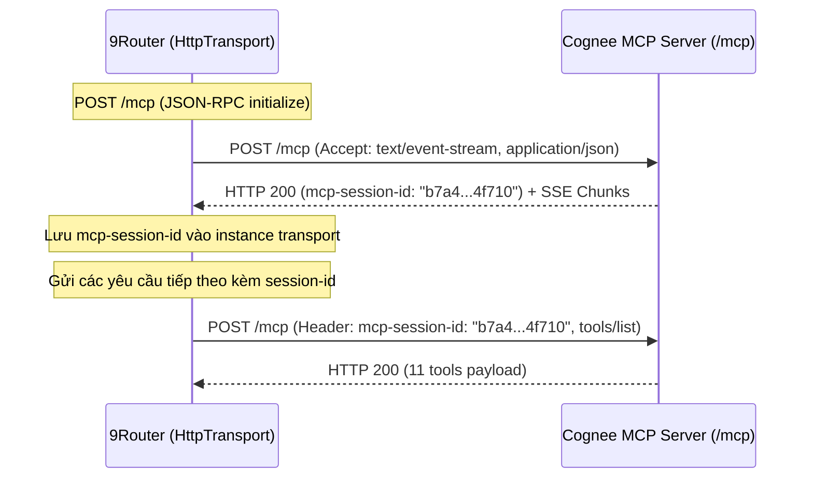
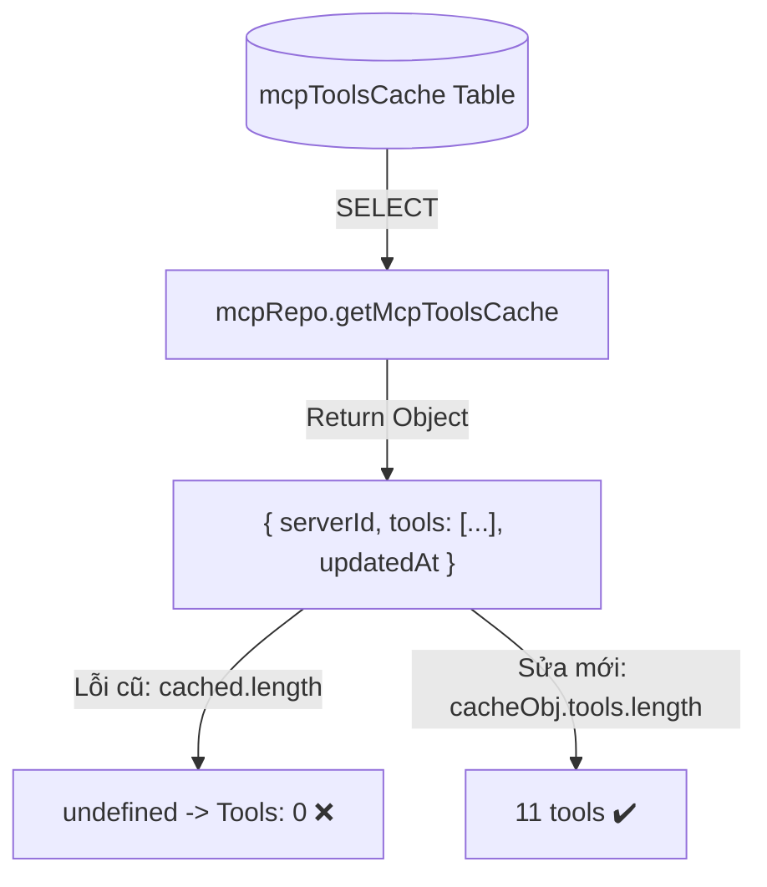

<style>
  @page {
    size: A4;
    margin: 20mm;
    @bottom-right {
      content: "Trang " counter(page) " / " counter(pages);
      font-size: 9pt;
      color: #666;
    }
  }
  .page-break {
    page-break-after: always;
    break-after: page;
  }
  .page-footer {
    display: flex;
    justify-content: space-between;
    font-size: 8.5pt;
    color: #888;
    border-top: 1px solid #e0e0e0;
    padding-top: 4px;
    margin-top: 24px;
  }
</style>

# Báo cáo Phân tích Kỹ thuật & Luồng Xử lý Sửa Lỗi Hệ thống 9Router

Tài liệu này tổng hợp chi tiết phân tích nguyên nhân gốc rễ (Root Cause), cơ chế khắc phục, sơ đồ luồng dữ liệu (CallGraph / Flowchart), và mã nguồn thực tế cho toàn bộ 6 sự cố kỹ thuật xảy ra trong quá trình hợp nhất PR #1, vận hành giao thức Codex Responses API, và quản trị hệ thống Model Context Protocol (MCP) trên máy chủ VPS.

---

## Mục lục

1. [Tổng quan Kiến trúc & Phạm vi Sự cố](#1-tổng-quan-kiến-trúc--phạm-vi-sự-cố) *(Trang 1)*
2. [Bug 1: Lỗi Scope Biến `ReferenceError: toolLedger is not defined`](#bug-1-lỗi-scope-biến-referenceerror-toolledger-is-not-defined) *(Trang 2)*
3. [Bug 2: Lỗi Thiếu Model Alias Antigravity Gây Vòng lặp Reconnecting](#bug-2-lỗi-thiếu-model-alias-antigravity-gây-vòng-lặp-reconnecting) *(Trang 3)*
4. [Bug 3: Lỗi Phân tích `namespace` & Khóa Tài khoản vì `web_search`](#bug-3-lỗi-phân-tích-namespace--khóa-tài-khoản-vì-web_search) *(Trang 4)*
5. [Bug 4: Lỗi Thiếu Chuẩn Web API `e.result.response.clone is not a function`](#bug-4-lỗi-thiếu-chuẩn-web-api-eresultresponseclone-is-not-a-function) *(Trang 5)*
6. [Bug 5: Lỗi Cloudflare Chặn 502 & Giao thức MCP Streamable HTTP](#bug-5-lỗi-cloudflare-chặn-502--giao-thức-mcp-streamable-http) *(Trang 6)*
7. [Bug 6: Lỗi Bóc Tách Cache Tools & Crash Giao diện React Activity Log](#bug-6-lỗi-bóc-tách-cache-tools--crash-giao-diện-react-activity-log) *(Trang 7)*
8. [Bảng Tổng hợp Mã nguồn & Source Mapping](#8-bảng-tổng-hợp-mã-nguồn--source-mapping) *(Trang 8)*

<div class="page-footer"><span>9Router VPS Bugfix Technical Explainer</span><span>Trang 1</span></div>
<div class="page-break"></div>

---

## 1. Tổng quan Kiến trúc & Phạm vi Sự cố

9Router hoạt động như một Gateway định tuyến và chuyển đổi giao thức AI tập trung. Hệ thống tiếp nhận các request từ nhiều chuẩn Client khác nhau (OpenAI Chat Completions, Codex Responses API, Anthropic Claude Messages, Google Gemini) và chuyển hướng tới hơn 40 nhà cung cấp (Upstream Providers) cùng vòng lặp Server-Side MCP ReAct Loop tự động.



### Bản đồ phân loại lỗi đã giải quyết:
- **Lớp Gateway Core**: Lỗi scope biến `toolLedger` khi tái cấu trúc `executeSingleTurn`.
- **Lớp Chuyển đổi Định dạng (Translator)**: Xử lý sai danh sách `tools` dạng `namespace` và `web_search` của OpenAI Responses API khi đưa vào Google Gemini.
- **Lớp Network Transport (Executor)**: Object response tự tạo trong module `proxyFetch.js` thiếu phương thức `.clone()` của chuẩn Web API `Response`.
- **Lớp Quản trị MCP (Process Manager & UI)**: Mâu thuẫn giao thức Streamable HTTP (`POST` + `mcp-session-id`) với Legacy SSE (`GET`), Cloudflare 502 HTML overwrite, và lỗi render Object trong React component.

<div class="page-footer"><span>9Router VPS Bugfix Technical Explainer</span><span>Trang 1</span></div>
<div class="page-break"></div>

---

## Bug 1: Lỗi Scope Biến `ReferenceError: toolLedger is not defined`

### 1. Vấn đề kỹ thuật
Khi gộp nhánh `master` vào PR #1, nhánh `master` đã tái cấu trúc `../../open-sse/handlers/chatCore.js` sang pattern hàm con `executeSingleTurn(body, stream)` để hỗ trợ ReAct loop đa lượt. Tuy nhiên, biến `toolLedger` chỉ được khai báo cục bộ bên trong hàm `executeSingleTurn`. Ở luồng thực thi chính bên ngoài, khi hệ thống khởi tạo `sharedCtx = { ..., toolLedger, ... }`, JavaScript ném ra lỗi `ReferenceError: toolLedger is not defined`, làm mọi request gọi qua `/v1/chat/completions` bị trả về mã `500 Internal Server Error`.

### 2. Sơ đồ luồng lỗi (CallGraph)



### 3. Mã nguồn thực tế khắc phục

```javascript
// open-sse/handlers/chatCore.js:513-552
// Trích xuất đầy đủ toolLedger từ execData trong luồng thực thi chính
let { result, translatedBody, toolNameMap, customToolNames, toolLedger, pxpipeSummary } = execData;
let providerResponse = result.response;
let providerUrl = result.url;
let providerHeaders = result.headers;
let finalBody = result.transformedBody;
let providerResponseFormat = result.responseFormat || targetFormat;
reqLogger.logTargetRequest(providerUrl, providerHeaders, finalBody);

// Cập nhật lại toolLedger khi thực hiện Token Refresh Retry
if (!executor.noAuth && (providerResponse.status === HTTP_STATUS.UNAUTHORIZED || providerResponse.status === HTTP_STATUS.FORBIDDEN)) {
  // ... refresh logic ...
  const retryExecData = await executeSingleTurn(body, stream);
  if (retryExecData.result.response.ok) {
    execData = retryExecData;
    toolLedger = retryExecData.toolLedger;
    toolNameMap = retryExecData.toolNameMap;
    customToolNames = retryExecData.customToolNames;
    translatedBody = retryExecData.translatedBody;
    pxpipeSummary = retryExecData.pxpipeSummary;
  }
}
```

### 4. Ẩn dụ (Analogy)
Giống như đầu bếp chuẩn bị một cuốn sổ ghi nhớ (`toolLedger`) bên trong phòng bếp phụ (`executeSingleTurn`), nhưng khi bồi bàn đem món ăn ra phòng khách (`sharedCtx`) lại tìm cuốn sổ đó ở bàn lễ tân bên ngoài. Vì không ai mang cuốn sổ ra khỏi bếp phụ, toàn bộ quy trình phục vụ bị gián đoạn.

<div class="page-footer"><span>9Router VPS Bugfix Technical Explainer</span><span>Trang 2</span></div>
<div class="page-break"></div>

---

## Bug 2: Lỗi Thiếu Model Alias Antigravity Gây Vòng lặp Reconnecting

### 1. Vấn đề kỹ thuật
Client Codex CLI cấu hình gọi model dưới tên ngắn `ag/gemini-3.7-flash`. Trong danh mục `../../open-sse/providers/registry/antigravity.js`, hệ thống chỉ khai báo các model có hậu tố chỉ định mức độ suy nghĩ (`gemini-3.7-flash-high`, `medium`, `low`). Khi không tìm thấy alias, 9Router chuyển nguyên chuỗi `gemini-3.7-flash` lên Google CloudCode API. Google trả về lỗi `404 NOT_FOUND: Requested entity was not found`. Client Codex thấy mã 404 tưởng kết nối mạng bị đứt và liên tục thử kết nối lại (reconnecting loop).

### 2. Sơ đồ xử lý định tuyến Model (Flowchart)

```mermaid
flowchart TD
    Req([Client Request: ag/gemini-3.7-flash]) --> Lookup{Tìm trong Antigravity Registry?}
    Lookup -->|Không có Alias| DirectSend[Gửi nguyên văn 'gemini-3.7-flash' tới Google]
    DirectSend --> Google404[Google API: 404 Requested entity not found]
    Google404 --> Reconnect[Codex CLI Reconnecting Vô hạn]
    
    Lookup -->|Đã thêm Alias| MapHigh[Ánh xạ sang 'gemini-3.7-flash-tiered(high)']
    MapHigh --> Google200[Google API: 200 OK + Stream Chunks]
```

### 3. Mã nguồn thực tế khắc phục

```javascript
// open-sse/providers/registry/antigravity.js:47-54
export default {
  // ...
  models: [
    // Bổ sung alias mặc định trỏ về tiered(high)
    { id: "gemini-3.7-flash", name: "Gemini 3.7 Flash", upstreamModelId: "gemini-3.7-flash-tiered(high)" },
    { id: "gemini-3.7-flash-high", name: "Gemini 3.7 Flash (High)", upstreamModelId: "gemini-3.7-flash-tiered(high)" },
    { id: "gemini-3.7-flash-medium", name: "Gemini 3.7 Flash (Medium)", upstreamModelId: "gemini-3.7-flash-tiered(medium)" },
    { id: "gemini-3.7-flash-low", name: "Gemini 3.7 Flash (Low)", upstreamModelId: "gemini-3.7-flash-tiered(low)" },
    { id: "gemini-3.6-flash", name: "Gemini 3.6 Flash", upstreamModelId: "gemini-3.6-flash-tiered(high)" },
    { id: "gemini-3.6-flash-high", name: "Gemini 3.6 Flash (High)", upstreamModelId: "gemini-3.6-flash-tiered(high)" },
  ],
};
```

<div class="page-footer"><span>9Router VPS Bugfix Technical Explainer</span><span>Trang 3</span></div>
<div class="page-break"></div>

---

## Bug 3: Lỗi Phân tích `namespace` & Khóa Tài khoản vì `web_search`

### 1. Vấn đề kỹ thuật
1. **Lỗi `namespace`**: Codex CLI đóng gói các công cụ trong cấu trúc lồng nhau `{ type: "namespace", name: "developer", tools: [...] }`. Module `openai-responses.js` coi toàn bộ object `namespace` là một công cụ không tên và đưa vào danh sách `_hostedTools`.
2. **Lỗi `web_search`**: Codex luôn gửi kèm công cụ `{ type: "web_search" }`. Adapter `openai-to-gemini.js` khi thấy danh sách `_hostedTools` có phần tử liền ném ngoại lệ `UnsupportedHostedToolError`. Lỗi này trả về mã `502`, kích hoạt cơ chế `accountFallback` khóa toàn bộ tài khoản Google trong 30 giây.

### 2. Sơ đồ xử lý công cụ (CallGraph)



### 3. Mã nguồn thực tế khắc phục

```javascript
// open-sse/translator/request/openai-responses.js:17-31
function flattenResponseTools(tools) {
  const flattened = [];
  for (const tool of tools || []) {
    if (!tool || typeof tool !== "object") continue;
    // Mở gói đệ quy các công cụ nằm bên trong namespace
    if (tool.type === "namespace" && Array.isArray(tool.tools)) {
      flattened.push(...flattenResponseTools(tool.tools));
    } else if (tool.type === "namespace") {
      continue;
    } else {
      flattened.push(tool);
    }
  }
  return flattened;
}
```

```javascript
// open-sse/translator/request/openai-to-gemini.js:100-106
// Bỏ cơ chế throw UnsupportedHostedToolError, âm thầm loại bỏ hosted tools không hỗ trợ
function openaiToGeminiBase(model, body, stream, signature = DEFAULT_THINKING_AG_SIGNATURE) {
  const toolLedger = body._toolLedger || new ToolLedger();
  const result = {
    model: model,
    contents: [],
    // ...
```

<div class="page-footer"><span>9Router VPS Bugfix Technical Explainer</span><span>Trang 4</span></div>
<div class="page-break"></div>

---

## Bug 4: Lỗi Thiếu Chuẩn Web API `e.result.response.clone is not a function`

### 1. Vấn đề kỹ thuật
Khi chạy trên VPS, 9Router kích hoạt cơ chế `createBypassRequest` trong `../../open-sse/utils/proxyFetch.js` để kết nối trực tiếp IP của Google tránh bị DNS can thiệp. Hàm này trước đó tự tạo một object phản hồi giả lập thuần túy chỉ có thuộc tính `text()` và `json()`, không có phương thức `.clone()`. Khi luồng ReAct Loop gọi `execData.result.response.clone()` để vừa phân tích JSON usage vừa stream dữ liệu, hệ thống bị crash với lỗi `TypeError: response.clone is not a function`.

### 2. Sơ đồ so sánh Cấu trúc Response



### 3. Mã nguồn thực tế khắc phục

```javascript
// open-sse/utils/proxyFetch.js:266-278
const req = https.request(reqOptions, (res) => {
  const resHeaders = new Headers();
  for (const [k, v] of Object.entries(res.headers || {})) {
    if (Array.isArray(v)) v.forEach((x) => resHeaders.append(k, String(x)));
    else if (v != null) resHeaders.set(k, String(v));
  }
  // Sử dụng chuẩn Web API Response chính thức của Node.js runtime
  const body = Readable.toWeb(res);
  resolve(new Response(body, {
    status: res.statusCode,
    statusText: res.statusMessage || "",
    headers: resHeaders,
  }));
});
```

```javascript
// open-sse/handlers/chatCore.js:374-380
// Bọc an toàn phòng thủ khi gọi .clone()
if (!turnStream) {
  try {
    if (typeof execData?.result?.response?.clone === "function") {
      const cloned = execData.result.response.clone();
      parsedResponse = await cloned.json();
      usage = parsedResponse?.usage;
    }
  } catch { }
}
```

<div class="page-footer"><span>9Router VPS Bugfix Technical Explainer</span><span>Trang 5</span></div>
<div class="page-break"></div>

---

## Bug 5: Lỗi Cloudflare Chặn 502 & Giao thức MCP Streamable HTTP

### 1. Vấn đề kỹ thuật
1. **Lỗi Cloudflare ghi đè HTML**: Khi test kết nối MCP thất bại, `/api/mcp/test` trả về mã HTTP `502`. Cloudflare CDN chặn response này và thay thế bằng trang HTML `<!DOCTYPE html>... Error 502`. Frontend gọi `await res.json()` bị lỗi cú pháp `Unexpected token '<', "<!DOCTYPE "... is not valid JSON`.
2. **Lỗi Giao thức Streamable HTTP**: Máy chủ Cognee MCP dùng chuẩn Streamable HTTP (`POST /mcp` nhận SSE stream). 9Router lại dùng `SseTransport` cũ gửi `GET /mcp`, khiến Cognee từ chối với lỗi `HTTP 400 Bad Request: Missing session ID`.

### 2. Sơ đồ bắt tay giao thức Streamable HTTP



### 3. Mã nguồn thực tế khắc phục

```javascript
// src/lib/mcp/httpTransport.js:25-55
async send(message) {
  validateUrlSecurity(this.url, { allowPrivateIps: this.allowPrivateIps });

  const headers = {
    "Content-Type": "application/json",
    Accept: "text/event-stream, application/json",
    ...this.headers,
  };

  if (this.sessionId) {
    headers["mcp-session-id"] = this.sessionId;
  }

  const res = await fetch(this.url, {
    method: "POST",
    headers,
    body: JSON.stringify(message),
    signal: this.abortController?.signal,
  });

  const returnedSessionId = res.headers.get("mcp-session-id");
  if (returnedSessionId) {
    this.sessionId = returnedSessionId;
  }
  // Xử lý cả phản hồi dạng SSE Stream lẫn JSON trực tiếp...
}
```

```javascript
// src/app/api/mcp/test/route.js:57-65
// Trả về HTTP 200 với flag success: false để Cloudflare không ghi đè HTML
} catch (err) {
  const durationMs = Date.now() - startTime;
  const sanitized = sanitizeMcpError(err);
  return NextResponse.json({
    success: false,
    error: sanitized.message || String(err),
    code: "MCP_PING_FAILED",
    durationMs,
  });
}
```

<div class="page-footer"><span>9Router VPS Bugfix Technical Explainer</span><span>Trang 6</span></div>
<div class="page-break"></div>

---

## Bug 6: Lỗi Bóc Tách Cache Tools & Crash Giao diện React Activity Log

### 1. Vấn đề kỹ thuật
1. **Lỗi `Tools: 0`**: Hàm `getMcpToolsCache(serverId)` trả về một object `{ serverId, tools: [...], updatedAt }`. Các API `/api/mcp/servers` và `/api/mcp/tools` đọc trực tiếp `cachedTools.length` trên object thay vì `cachedTools.tools.length`, dẫn tới giá trị `undefined` và hiển thị 0 tools trên Dashboard.
2. **Lỗi Crash Trang Activity Logs**: `act.error` được lưu trữ dưới dạng một object `{ message, code, details }`. Khi người dùng click mở rộng một task lỗi trên giao diện, React cố gắng render trực tiếp object vào thẻ `<pre>`, gây crash toàn bộ trang giao diện với lỗi `Objects are not valid as a React child`.

### 2. Sơ đồ cấu trúc dữ liệu Cache & Render



### 3. Mã nguồn thực tế khắc phục

```javascript
// src/app/api/mcp/servers/route.js:48-58
const result = await Promise.all(
  servers.map(async (srv) => {
    const status = pm.getServerStatus(srv.id);
    const cacheObj = await getMcpToolsCache(srv.id);
    const tools = Array.isArray(cacheObj?.tools) ? cacheObj.tools : (Array.isArray(cacheObj) ? cacheObj : []);
    return {
      ...srv,
      status,
      toolCount: tools.length, // Trích xuất đúng số lượng công cụ
    };
  })
);
```

```javascript
// src/app/(dashboard)/dashboard/mcp/activity/page.js:239-245
// Xử lý an toàn khi render chi tiết lỗi trên giao diện
<pre className={`p-2.5 rounded-lg font-mono overflow-x-auto max-h-60 whitespace-pre-wrap ${
  act.isError ? "bg-red-500/10 text-red-600 dark:text-red-400" : "bg-surface-2 text-text-main"
}`}>
  {act.isError
    ? (typeof act.error === "object"
        ? JSON.stringify(act.error, null, 2)
        : (act.error || JSON.stringify(act.result, null, 2) || "Unknown error"))
    : (typeof act.result === "object" ? JSON.stringify(act.result, null, 2) : String(act.result ?? ""))}
</pre>
```

<div class="page-footer"><span>9Router VPS Bugfix Technical Explainer</span><span>Trang 7</span></div>
<div class="page-break"></div>

---

## 8. Bảng Tổng hợp Mã nguồn & Source Mapping

| Tệp nguồn (File Path) | Tầng kiến trúc | Vai trò & Thay đổi kỹ thuật |
| :--- | :--- | :--- |
| `../../open-sse/handlers/chatCore.js` | Chat Execution Core | Khai báo và destructure biến `toolLedger` chuẩn xác trong phạm vi hàm luồng chính và luồng token refresh retry; bọc an toàn `.clone()`. |
| `../../open-sse/providers/registry/antigravity.js` | Provider Registry | Khai báo alias model `gemini-3.7-flash` và `gemini-3.6-flash` tự động chuyển tiếp tới `gemini-3.7-flash-tiered(high)`. |
| `../../open-sse/translator/request/openai-responses.js` | Request Translator | Bổ sung hàm `flattenResponseTools()` mở gói đệ quy các công cụ trong `type: "namespace"` của Codex Responses API. |
| `../../open-sse/translator/request/openai-to-gemini.js` | Request Translator | Chuyển đổi công cụ an toàn, loại bỏ cơ chế ném ngoại lệ khi gặp `_hostedTools` (như `web_search`), truyền `_toolLedger` vào cloud code envelope. |
| `../../open-sse/utils/proxyFetch.js` | Network Transport | Sử dụng `new Response(Readable.toWeb(res))` chuẩn Web API thay thế object mock tự tạo trong hàm `createBypassRequest`. |
| `../../src/lib/mcp/httpTransport.js` | MCP Transport Layer | Xây dựng class `HttpTransport` hỗ trợ toàn diện chuẩn Streamable HTTP MCP (POST + header `mcp-session-id` + SSE decoding). |
| `../../src/lib/mcp/processManager.js` | MCP Process Lifecycle | Tích hợp `HttpTransport`, tự động lưu cache tools vào SQLite repo và kích hoạt cơ chế tự động auto-start server on-demand. |
| `../../src/lib/mcp/security.js` | Security Guard | Tự động tách chuỗi command chứa khoảng trắng và tự động chèn cờ `-y` cho lệnh `npx` / `uvx` tránh bị treo non-interactive. |
| `../../src/app/api/mcp/test/route.js` | REST API Controller | Trả về mã HTTP 200 kèm JSON error khi test thất bại để Cloudflare không chặn; đồng bộ ghi `pm.logActivity()` cho mọi lượt gọi. |
| `../../src/app/api/mcp/tools/route.js` | REST API Controller | Bóc tách mảng `tools` từ đối tượng `cacheObj` trả về từ `getMcpToolsCache`. |
| `../../src/app/api/mcp/servers/route.js` | REST API Controller | Đếm chính xác số lượng công cụ `toolCount` từ `cacheObj.tools.length`. |
| `src/app/(dashboard)/dashboard/mcp/activity/page.js` | Frontend UI Component | Định dạng an toàn `JSON.stringify(act.error)` tránh crash React component khi xem chi tiết công việc bị lỗi. |
| `../../src/shared/components/Sidebar.js` | Frontend UI Navigation | Hợp nhất menu Sidebar thành **Skills & MCP** (`/dashboard/skills`) và loại bỏ mục thừa. |

---
*Tài liệu được tổng hợp tự động theo chuẩn Explain Technical Flow — 9Router Gateway Engineering Team.*

<div class="page-footer"><span>9Router VPS Bugfix Technical Explainer</span><span>Trang 8</span></div>
