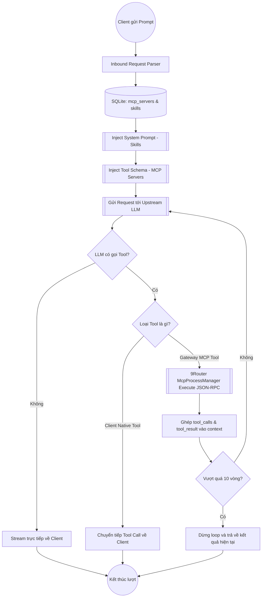
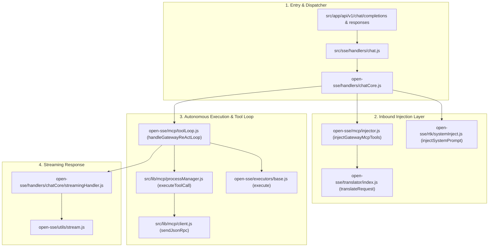

# Tài Liệu Kỹ Thuật: Kiến Trúc Server-Side MCP & Skills Gateway Trên 9Router

Tài liệu thiết kế và giải thích chi tiết luồng hoạt động của hệ sinh thái **Server-Side MCP & Skills Gateway** tích hợp trực tiếp trên 9Router — Cho phép mọi Harness/Client (Codex CLI, Claude Code, Cursor, OpenCode, Roo Code) tự động thừa hưởng toàn bộ MCP Tools và Skills mà không cần bất kỳ cấu hình nào ở phía Client.

---

## 1. Mở đầu — Vấn đề (Problem Statement)

**Tại sao cần cơ chế Server-Side MCP & Skills Gateway trên 9Router?**
- **Sự phân mảnh cấu hình Client (Client Configuration Fragmentation)**: Mỗi công cụ AI Agent có cách khai báo MCP và Skill riêng biệt: Codex dùng `~/.codex/config.toml`, Claude Code dùng `~/.claude.json`, Cursor dùng `.cursor/mcp.json`, OpenCode dùng `opencode.jsonc`. Khi làm việc trên nhiều máy hoặc nhiều IDE, lập trình viên phải sao chép API keys, tokens và cấu hình trùng lặp ở khắp mọi nơi.
- **Lệch chuẩn Protocol & Namespace (Protocol & Tool Calling Mismatch)**: Một số mô hình (như Gemini Flash trên Antigravity) dễ bị nhầm lẫn khi gọi tool nếu tên namespace quá dài hoặc format schema không tương thích với định dạng Responses API của Codex.
- **Rủi ro lộ bảo mật Credentials (Secret Sprawl)**: Đưa tokens của Database nội bộ, GitHub PAT, Sentry DSN vào từng máy cá nhân tiềm ẩn nguy cơ rò rỉ.

**Giải pháp của 9Router:**
Biến 9Router thành **AI Agent Gateway trung tâm**:
1. Toàn bộ MCP Servers (Database, Search, Devtools, Memory) và Skills được khai báo và chạy tập trung trên 9Router.
2. 9Router tự động tiêm (Inject) thông tin Skill vào System Prompt và danh sách Tools (`tools[]`) vào Request của Client.
3. Khi LLM kích hoạt gọi Tool của Gateway, 9Router chặn lại, tự động thực thi Tool qua JSON-RPC, nạp kết quả vào context và tiếp tục gọi LLM (vòng lặp **Autonomous ReAct Gateway Loop**) cho đến khi hoàn tất rồi mới stream câu trả lời về cho Client.

---

## 2. Chi Tiết Từng Bước Xử Lý (Step-by-Step Implementation)

### Bước 1: Quản lý tập trung MCP Servers & Skills trên Gateway
9Router quản lý danh sách MCP Server và định nghĩa Skill trong SQLite (`../../src/lib/db`), kèm tiến trình `McpProcessManager` để khởi tạo các kết nối Stdio, SSE hoặc HTTP.

```javascript
// src/lib/mcp/processManager.js (Mô phỏng kiến trúc Process Manager)
import { spawn } from "child_process";

export class McpProcessManager {
  constructor() {
    this.activeProcesses = new Map();
    this.toolsCache = new Map(); // serverName -> Array<ToolSchema>
  }

  async startServer(serverConfig) {
    const { name, transport, command, args, env, url } = serverConfig;
    if (transport === "stdio") {
      const proc = spawn(command, args, { env: { ...process.env, ...env } });
      this.activeProcesses.set(name, proc);
      await this.initializeAndSyncTools(name, proc);
    }
  }

  async executeToolCall(serverName, toolName, argumentsObj) {
    // Gửi JSON-RPC 2.0 "tools/call" tới MCP Server process
    return await this.sendJsonRpc(serverName, "tools/call", {
      name: toolName,
      arguments: argumentsObj
    });
  }
}
```

---

### Bước 2: Tự động tiêm Skill Prompt & MCP Tool Definitions (Format-Aware Inbound Injection)
Trước khi chuyển tiếp request từ Client sang Upstream LLM, 9Router bổ sung System Prompt của Skill và toàn bộ `tools[]` từ các MCP Server đang kích hoạt.

```javascript
// open-sse/rtk/systemInject.js:9-27 (Tận dụng cơ chế System Prompt Injection hiện có)
export function injectSystemPrompt(body, format, prompt) {
  if (!body || !prompt) return;

  switch (format) {
    case FORMATS.CLAUDE:
      injectClaudeSystem(body, prompt);
      return;
    case FORMATS.ANTIGRAVITY:
    case FORMATS.GEMINI:
      injectGeminiSystem(body, prompt);
      return;
    default:
      // OpenAI / Codex Responses / Cursor / Kiro
      injectMessagesSystem(body, prompt);
  }
}
```

```javascript
// open-sse/mcp/injector.js (Logic bổ sung Tool Definition vào Request Body)
export function injectGatewayMcpTools(body, format, mcpTools) {
  if (!mcpTools || mcpTools.length === 0) return body;

  const namespacedTools = mcpTools.map(tool => ({
    type: "function",
    function: {
      name: `mcp__${tool.server}__${tool.name}`,
      description: `[Gateway Tool] ${tool.description}`,
      parameters: tool.inputSchema
    }
  }));

  if (format === FORMATS.CLAUDE) {
    body.tools = [...(body.tools || []), ...convertToClaudeTools(namespacedTools)];
  } else {
    // OpenAI & Responses API format
    body.tools = [...(body.tools || []), ...namespacedTools];
  }
  return body;
}
```

**Bảng chuyển đổi Tool Schema (Input → Namespaced Injection):**
| MCP Tool Gốc | Server Name | Format Đích (OpenAI / Codex) | Format Đích (Claude) |
|---|---|---|---|
| `query_database` | `chat2db` | `name: "mcp__chat2db__query_database"`, type: `function` | `name: "mcp__chat2db__query_database"`, `input_schema: {...}` |
| `list_datasets` | `cognee` | `name: "mcp__cognee__list_datasets"`, type: `function` | `name: "mcp__cognee__list_datasets"`, `input_schema: {...}` |

---

### Bước 3: Autonomous Server-Side ReAct Loop (Vòng lặp thực thi Tool tại Gateway)
Khi LLM trả về phản hồi chứa `tool_calls`, 9Router phân loại:
- **Client Tools** (e.g. `read_file`, `edit_file` của Cursor/Codex): Bỏ qua, trả thẳng về cho Client tự xử lý.
- **Gateway MCP Tools** (có prefix `mcp__`): Chặn lại, thực thi trực tiếp trên server, ghép kết quả vào mảng `messages` và tự động kích hoạt lượt gọi LLM kế tiếp.

```javascript
// open-sse/mcp/toolLoop.js (Cốt lõi vòng lặp ReAct tại Gateway)
export async function handleGatewayReActLoop({ initialBody, modelInfo, credentials, mcpManager, executeTurnFn }) {
  let currentBody = initialBody;
  let iterations = 0;
  const MAX_ITERATIONS = 10;

  while (iterations < MAX_ITERATIONS) {
    iterations++;
    const response = await executeTurnFn(currentBody);
    const toolCalls = extractToolCallsFromResponse(response);

    // Kiểm tra xem có tool call nào của Gateway MCP không
    const gatewayCalls = toolCalls.filter(tc => tc.function?.name?.startsWith("mcp__"));
    if (gatewayCalls.length === 0) {
      // Không còn gateway tool call -> Trả stream/response cuối cùng về cho Client
      return response;
    }

    // Thực thi các MCP Tool trên Server
    const toolResults = [];
    for (const call of gatewayCalls) {
      const [, serverName, toolName] = call.function.name.split("__");
      const args = JSON.parse(call.function.arguments || "{}");
      const result = await mcpManager.executeToolCall(serverName, toolName, args);
      toolResults.push({
        tool_call_id: call.id,
        role: "tool",
        name: call.function.name,
        content: JSON.stringify(result)
      });
    }

    // Cập nhật context cho lượt gọi tiếp theo
    currentBody = appendMessagesToTurn(currentBody, [
      { role: "assistant", tool_calls: gatewayCalls },
      ...toolResults
    ]);
  }
}
```

---

## 3. Flowchart — Sơ Đồ Xử Lý Logic (Mermaid Flowchart)



---

## 4. CallGraph — Sơ Đồ Quan Hệ Hàm (Mermaid Graph)



---

## 5. Ví Dụ Hình Dung (Analogy)

Hãy hình dung kiến trúc này giống như **Nhà Hàng Có Bếp Trưởng Toàn Năng (9Router)**:

1. **Khách hàng (Client: Cursor / Codex / Claude Code)**:
   - Khách bước vào chỉ cần gọi món: *"Hãy phân tích dữ liệu kho và xuất báo cáo"* mà không cần mang theo dao, bếp hay gia vị (không cần cài MCP hay Skill trên máy).
2. **Tiếp tân & Bếp trưởng (9Router Inbound Injection)**:
   - Bếp trưởng tự động bổ sung công thức nấu ăn bí truyền (**Skills**) và bày sẵn các dụng cụ chuyên dụng (**MCP Tools: SQL, Cognee, Devtools**) lên bàn chế biến.
3. **Phụ bếp tự động (Autonomous ReAct Gateway Loop)**:
   - Trong quá trình nấu, Bếp trưởng nhận thấy cần lấy thịt trong tủ đông (`mcp__database__query`).
   - Thay vì bắt khách hàng phải tự đi mở tủ lạnh, phụ bếp tại 9Router tự động chạy vào kho mở tủ lấy nguyên liệu, sơ chế và đưa lại cho Bếp trưởng nấu tiếp.
4. **Món ăn hoàn chỉnh (Final Streamed Response)**:
   - Bếp trưởng hoàn thành món ăn thơm ngon và dọn lên bàn cho khách. Khách hàng thưởng thức trọn vẹn kết quả một cách nhẹ nhàng, tinh gọn.

---

## 6. Bảng Mapping Source Code

| File | Vai trò |
|---|---|
| `../../src/lib/db/repos/mcpRepo.js` | Quản lý bảng cấu hình `mcpServers` và `mcpToolsCache` trong SQLite |
| `../../src/lib/db/repos/skillsRepo.js` | Quản lý kho `skills` và quy tắc kích hoạt `gatewayToolRules` |
| `../../src/lib/mcp/processManager.js` | Quản lý vòng đời tiến trình Stdio/SSE MCP Server và điều phối gọi JSON-RPC |
| `../../src/lib/mcp/stdioSseBridge.js` | Cầu nối giao tiếp stdio $\leftrightarrow$ SSE cho các plugin mở rộng |
| `../../open-sse/rtk/systemInject.js` | Tiêm nội dung System Prompt của Skills đa định dạng (OpenAI/Claude/Gemini/Codex) |
| `../../open-sse/mcp/injector.js` | Bổ sung Tool Schema (`tools[]`) của Gateway MCP vào Request Payload |
| `../../open-sse/mcp/toolLoop.js` | Điều phối vòng lặp ReAct: Chặn Tool Call, thực thi MCP tại server và gọi lại LLM |
| `../../open-sse/handlers/chatCore.js` | Điểm tích hợp luồng xử lý chính kết hợp Inbound Injection và Tool Loop |
| `src/app/(dashboard)/dashboard/skills/` | Giao diện WebUI quản lý, bật/tắt Skills và MCP Servers tập trung |
