<style>
  @page {
    size: A4;
    margin: 20mm;
    @bottom-right {
      content: "Trang " counter(page) " / " counter(pages);
      font-size: 9pt;
      color: #666;
    }
  }
  .page-break {
    page-break-after: always;
    break-after: page;
  }
  .page-footer {
    display: flex;
    justify-content: space-between;
    font-size: 8.5pt;
    color: #888;
    border-top: 1px solid #e0e0e0;
    padding-top: 4px;
    margin-top: 24px;
  }
</style>

# Tài liệu Kỹ thuật: Hệ thống In-Memory BM25 Search Index & Explicit Fast-Path cho MCP Tools & Custom Skills trong 9Router

---

## Mục lục

1. [Tổng quan & Bối cảnh kỹ thuật](#1-tổng-quan--bối-cảnh-kỹ-thuật) (Trang 1)
2. [Flow 1: Tokenization & Text Normalization](#flow-1-tokenization--text-normalization) (Trang 2)
3. [Flow 2: In-Memory BM25 Index Lifecycle & Singleton Sync](#flow-2-in-memory-bm25-index-lifecycle--singleton-sync) (Trang 3)
4. [Flow 3: Explicit Fast-Path Matcher ($skill & @server)](#flow-3-explicit-fast-path-matcher-skill--server) (Trang 4)
5. [Flow 4: Inbound Selection Pipeline & Budget Caps](#flow-4-inbound-selection-pipeline--budget-caps) (Trang 5)
6. [Flow 5: REST API Mutation Rebuild Triggers](#flow-5-rest-api-mutation-rebuild-triggers) (Trang 6)
7. [Bảng tổng hợp Source Mapping & Analogy Thực tế](#7-bảng-tổng-hợp-source-mapping--analogy-thực-tế) (Trang 7)

---

## 1. Tổng quan & Bối cảnh kỹ thuật

### Vấn đề là gì?
Trước đây, 9Router sử dụng cơ chế so khớp chuỗi con thô (`String.prototype.includes()`) trong module `../../open-sse/mcp/inboundSelection.js`:
- **Độ chính xác và độ phủ thấp:** Các prompt hội thoại tự nhiên hiếm khi chứa chính xác 100% mô tả của tool, trong khi các từ khóa ngắn (như `get`, `run`, `file`) gây ra tình trạng false positives hàng loạt.
- **Không có cơ chế xếp hạng:** Các candidates được chọn theo thứ tự chèn database và nhồi tới tối đa 30 tools (`MAX_INJECTED_TOOLS = 30`), làm loãng sự tập trung (attention context) của LLM và gây lãng phí token.
- **Không có fast-path định danh:** Người dùng gõ `$skill-name` hoặc `@server-name` vẫn phải qua duyệt chuỗi tuần tự.

### Giải pháp tối ưu
Tích hợp động cơ tìm kiếm xếp hạng cục bộ trong bộ nhớ RAM (**In-Memory BM25**) dựa trên `minisearch`:
- Zero network I/O, thời gian truy vấn dưới `1ms`.
- Trọng số boost đa tầng: `triggers` (4.0) > `keywords` (3.0) > `name` (2.0) > `description` (1.0).
- Hỗ trợ dung lỗi gõ nhầm (Fuzzy Typo Tolerance) và tìm kiếm tiền tố (Prefix Matching).
- Fast-Path Regex tức thì (`\$([a-zA-Z0-9_-]+)` và `@([a-zA-Z0-9_-]+)`).
- Kiểm soát ngân sách token (Top-K: mặc định tối đa 5 tools, 3 skills).
- Tự động rebuild bất đồng bộ khi cấu hình server/skill thay đổi qua API.

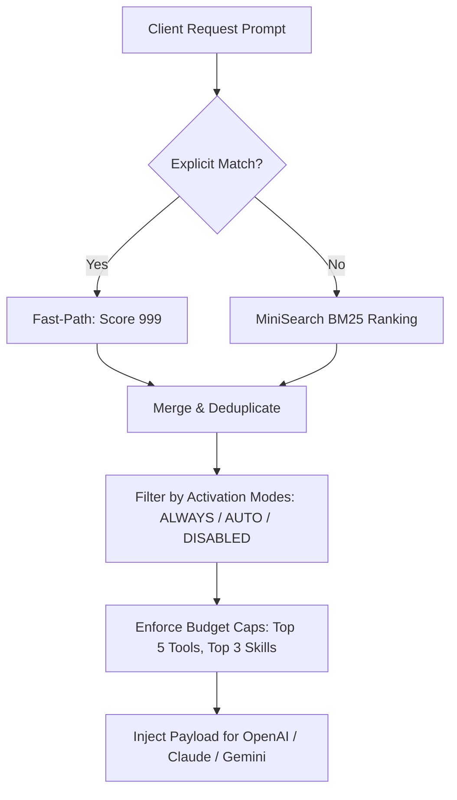

<div class="page-footer"><span>9Router — In-Memory BM25 Search Index</span><span>Trang 1</span></div>
<div class="page-break"></div>

---

## Flow 1: Tokenization & Text Normalization

### Vấn đề là gì?
Văn bản đầu vào từ user prompt có thể chứa ký tự Unicode tổ hợp, viết hoa/viết thường lộn xộn, stop words đa ngôn ngữ (tiếng Anh, tiếng Việt), và các định danh tool viết dạng snake_case / kebab-case (VD: `read_file`, `git-commit`). Cần chuẩn hóa và phân tách sub-tokens để BM25 bắt chính xác.

### CallGraph (Mermaid)
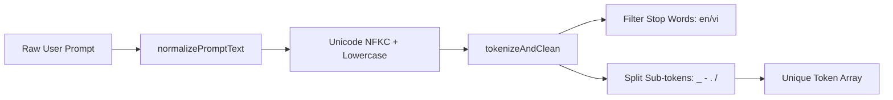

### Flowchart (Mermaid)
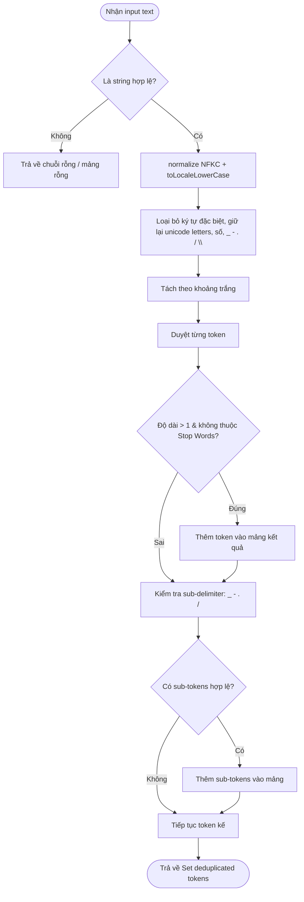

### Code Snippet Thật
```javascript
// open-sse/mcp/search/tokenizer.js:1-32
const COMMON_STOP_WORDS = new Set([
  "a", "an", "the", "and", "or", "to", "of", "in", "for", "on", "with", "at", "by", "from",
  "là", "và", "hoặc", "của", "trong", "cho", "trên", "với", "tại", "bởi", "từ", "hãy", "giúp"
]);

export function normalizePromptText(value) {
  if (typeof value !== "string") return "";
  return value
    .normalize("NFKC")
    .toLocaleLowerCase()
    .replace(/[^\p{L}\p{N}_\-./\\]+/gu, " ")
    .trim();
}

export function tokenizeAndClean(text) {
  if (typeof text !== "string") return [];
  const normalized = normalizePromptText(text);
  const tokens = [];
  for (const part of normalized.split(/\s+/)) {
    if (!part) continue;
    if (part.length > 1 && !COMMON_STOP_WORDS.has(part)) {
      tokens.push(part);
    }
    const subParts = part.split(/[_\-./\\]+/).filter((p) => p.length > 1 && !COMMON_STOP_WORDS.has(p));
    if (subParts.length > 1) {
      tokens.push(...subParts);
    }
  }
  return [...new Set(tokens)];
}
```

<div class="page-footer"><span>9Router — In-Memory BM25 Search Index</span><span>Trang 2</span></div>
<div class="page-break"></div>

---

## Flow 2: In-Memory BM25 Index Lifecycle & Singleton Sync

### Vấn đề là gì?
Tập hợp tools và skills thay đổi linh hoạt theo runtime (khi kết nối thêm MCP server hoặc user thêm custom skill). Nếu re-index đồng bộ trên luồng request sẽ gây nghẽn. Cần một singleton `ToolIndexManager` thực hiện indexing trong bộ nhớ với thao tác hoán đổi nguyên tử (Atomic Swap).

### CallGraph (Mermaid)
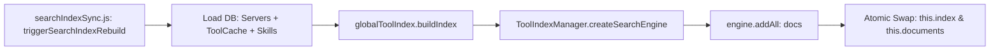

### Flowchart (Mermaid)
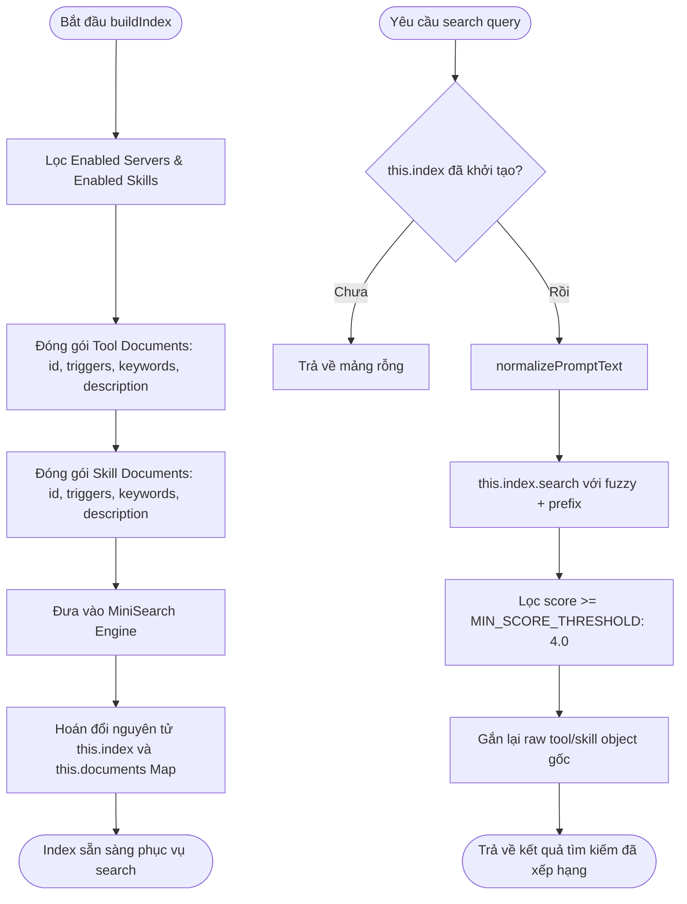

### Code Snippet Thật
```javascript
// open-sse/mcp/search/toolIndex.js:21-44, 97-123
export class ToolIndexManager {
  constructor() {
    this.index = null;
    this.documents = new Map();
  }

  static createSearchEngine() {
    return new MiniSearch({
      fields: ["triggers", "keywords", "name", "description"],
      storeFields: ["id", "type", "serverId", "name"],
      tokenize: (text) => tokenizeAndClean(text),
      searchOptions: {
        boost: MCP_SEARCH_CONFIG.BOOST,
        fuzzy: (term) => (term.length > 4 ? 0.2 : false),
        prefix: true,
        combineWith: "OR",
      },
    });
  }

  buildIndex({ servers = [], toolCache = [], skills = [] } = {}) {
    const engine = ToolIndexManager.createSearchEngine();
    const docs = [];
    const docMap = new Map();
    // ... thu thập và format documents từ tools và skills ...
    if (docs.length > 0) {
      engine.addAll(docs);
    }
    // Atomic swap
    this.index = engine;
    this.documents = docMap;
  }

  search(query, { minScore = MCP_SEARCH_CONFIG.MIN_SCORE_THRESHOLD } = {}) {
    if (!this.index || typeof query !== "string" || !query.trim()) return [];
    const normalized = normalizePromptText(query);
    if (!normalized) return [];

    const searchResults = this.index.search(normalized);
    return searchResults
      .filter((res) => res.score >= minScore)
      .map((res) => {
        const fullDoc = this.documents.get(res.id);
        return { ...res, ...fullDoc };
      });
  }
}

export const globalToolIndex = new ToolIndexManager();
```

<div class="page-footer"><span>9Router — In-Memory BM25 Search Index</span><span>Trang 3</span></div>
<div class="page-break"></div>

---

## Flow 3: Explicit Fast-Path Matcher ($skill & @server)

### Vấn đề là gì?
Khi người dùng chủ động nhắc đến `$commit-msg` hoặc `@github`, hệ thống phải kích hoạt ngay lập tức server/skill tương ứng với độ chính xác 100% mà không cần tính toán độ tương đồng BM25.

### CallGraph (Mermaid)
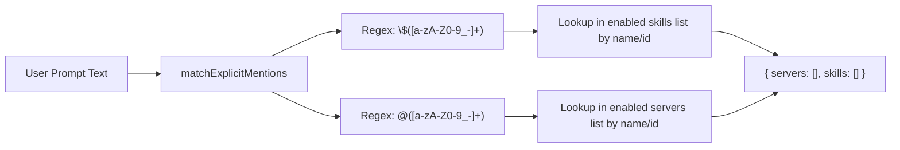

### Flowchart (Mermaid)
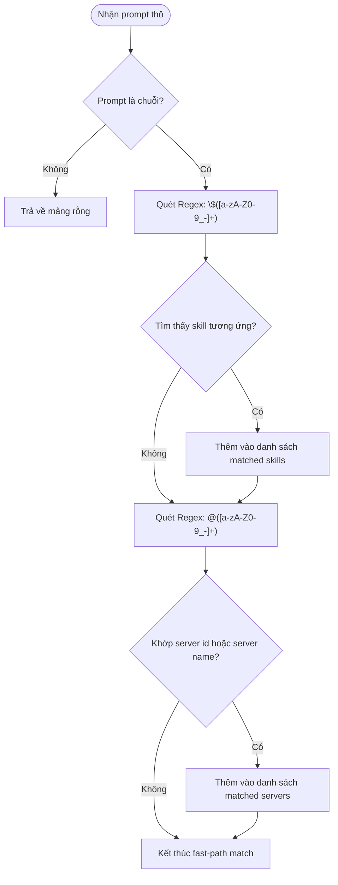

### Code Snippet Thật
```javascript
// open-sse/mcp/search/explicitMatcher.js:1-36
const SKILL_MENTION_REGEX = /\$([a-zA-Z0-9_-]+)/g;
const SERVER_MENTION_REGEX = /@([a-zA-Z0-9_-]+)/g;

export function matchExplicitMentions(prompt, { skills = [], servers = [] } = {}) {
  const matchedSkills = [];
  const matchedServers = [];

  if (typeof prompt !== "string" || !prompt.trim()) {
    return { skills: matchedSkills, servers: matchedServers };
  }

  // Match $skill-name
  const skillMatches = [...prompt.matchAll(SKILL_MENTION_REGEX)].map((m) => m[1].toLowerCase());
  if (skillMatches.length > 0 && Array.isArray(skills)) {
    for (const skill of skills) {
      if (!skill?.name) continue;
      const normalizedName = skill.name.toLowerCase();
      if (skillMatches.includes(normalizedName)) {
        matchedSkills.push(skill);
      }
    }
  }

  // Match @server-name
  const serverMatches = [...prompt.matchAll(SERVER_MENTION_REGEX)].map((m) => m[1].toLowerCase());
  if (serverMatches.length > 0 && Array.isArray(servers)) {
    for (const server of servers) {
      if (!server?.id) continue;
      const serverId = server.id.toLowerCase();
      const serverName = (server.name || "").toLowerCase();
      if (serverMatches.includes(serverId) || serverMatches.includes(serverName)) {
        matchedServers.push(server);
      }
    }
  }

  return { skills: matchedSkills, servers: matchedServers };
}
```

<div class="page-footer"><span>9Router — In-Memory BM25 Search Index</span><span>Trang 4</span></div>
<div class="page-break"></div>

---

## Flow 4: Inbound Selection Pipeline & Budget Caps

### Vấn đề là gì?
Tập hợp các nguồn tool/skill từ: (1) Explicit Fast-Path, (2) ALWAYS mode, (3) BM25 Search (cho AUTO mode). Cần gom tụ, loại trùng lặp, áp dụng allow-list từ header `x-mcp-servers`, và giới hạn nghiêm ngặt số lượng tool/skill được inject để bảo vệ token budget.

### CallGraph (Mermaid)
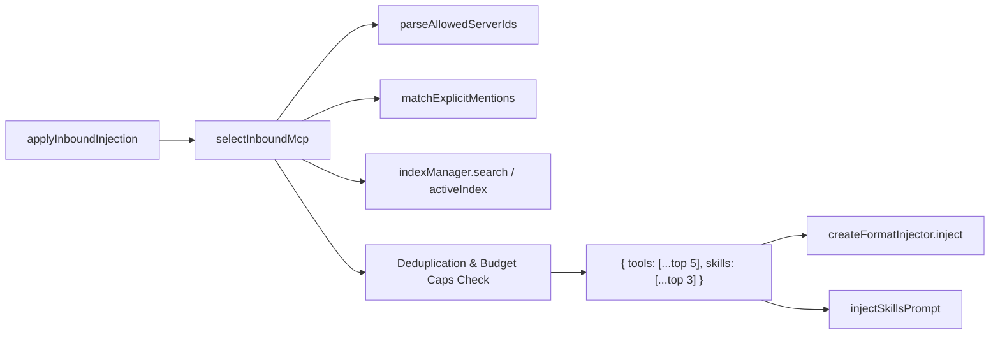

### Flowchart (Mermaid)
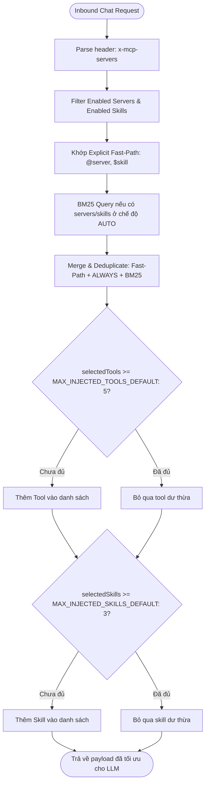

### Code Snippet Thật
```javascript
// open-sse/mcp/inboundSelection.js:186-243
    // 4. Collect ALWAYS & fast-path matches
    const selectedTools = [];
    const selectedToolKeys = new Set();
    const selectedSkills = [];
    const selectedSkillKeys = new Set();

    function addTool(serverId, tool) {
      if (!isPlainObject(tool) || !tool.name || selectedTools.length >= MCP_SEARCH_CONFIG.MAX_INJECTED_TOOLS_DEFAULT) return;
      const key = `${serverId}:${tool.name}`;
      if (selectedToolKeys.has(key)) return;
      selectedToolKeys.add(key);
      selectedTools.push({ serverId, tool });
    }

    function addSkill(skill) {
      if (!isPlainObject(skill) || !skill.name || selectedSkills.length >= MCP_SEARCH_CONFIG.MAX_INJECTED_SKILLS_DEFAULT) return;
      const key = skill.id || skill.name;
      if (selectedSkillKeys.has(key)) return;
      selectedSkillKeys.add(key);
      selectedSkills.push(skill);
    }

    // 5. BM25 search for AUTO candidates
    const autoServers = enabledServers.filter((s) => modeFrom(s) === MCP_ACTIVATION_MODE.AUTO);
    const autoSkills = enabledSkills.filter((s) => modeFrom(s, s.matchRules) === MCP_ACTIVATION_MODE.AUTO);

    let searchTools = [];
    let searchSkills = [];

    if (rawPrompt && (autoServers.length > 0 || autoSkills.length > 0)) {
      const activeIndex = indexManager || new ToolIndexManager();
      if (!activeIndex.index) {
        activeIndex.buildIndex({
          servers: indexManager ? enabledServers : autoServers,
          toolCache,
          skills: indexManager ? enabledSkills : autoSkills,
        });
      }

      const searchResults = activeIndex.search(rawPrompt);
      for (const item of searchResults) {
        if (item.type === "tool" && item.serverId && item.raw) {
          searchTools.push({ serverId: item.serverId, tool: item.raw });
        } else if (item.type === "skill" && item.raw) {
          searchSkills.push(item.raw);
        }
      }
      // ...
    }
```

<div class="page-footer"><span>9Router — In-Memory BM25 Search Index</span><span>Trang 5</span></div>
<div class="page-break"></div>

---

## Flow 5: REST API Mutation Rebuild Triggers

### Vấn đề là gì?
Khi người dùng quản trị tạo mới, chỉnh sửa trạng thái enable/disable, xóa server hoặc cập nhật tool cache qua giao diện dashboard, chỉ mục BM25 phải được cập nhật tức thì mà không làm treo hoặc chậm phản hồi của REST API.

### CallGraph (Mermaid)
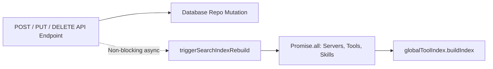

### Flowchart (Mermaid)
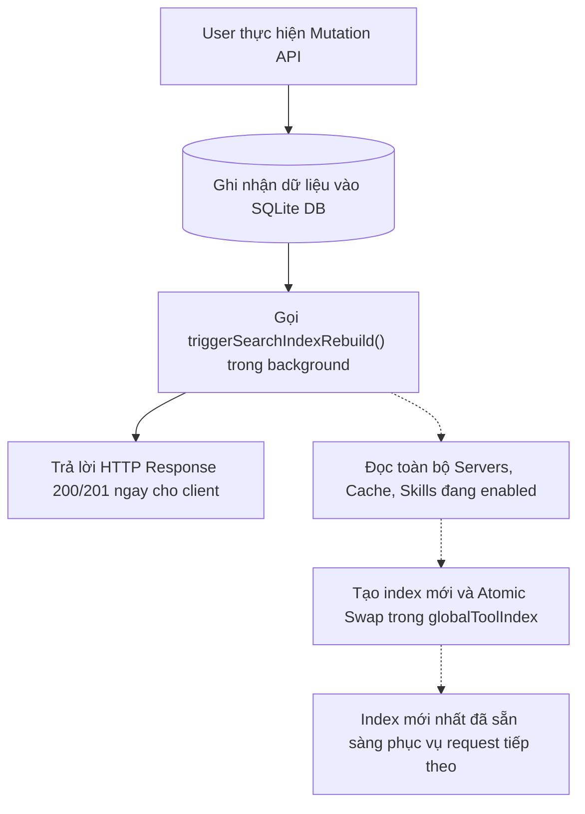

### Code Snippet Thật
```javascript
// src/lib/mcp/searchIndexSync.js:1-25
import { globalToolIndex } from "../../../open-sse/mcp/search/toolIndex.js";
import { getEnabledMcpServers, getAllMcpToolsCache } from "../db/repos/mcpRepo.js";
import { getEnabledSkills } from "../db/repos/skillsRepo.js";

/**
 * Triggers an asynchronous rebuild of the global in-memory tool & skill search index.
 * Fail-safe: catches and logs any errors via console.warn without throwing.
 */
export async function triggerSearchIndexRebuild() {
  try {
    const [servers, toolCache, skills] = await Promise.all([
      getEnabledMcpServers(),
      getAllMcpToolsCache(),
      getEnabledSkills(),
    ]);

    globalToolIndex.buildIndex({
      servers,
      toolCache,
      skills,
    });
  } catch (err) {
    console.warn("[MCP_SEARCH_INDEX] Failed to rebuild search index:", err?.message || err);
  }
}
```

```javascript
// src/app/api/mcp/servers/route.js:93-96
const newServer = await createMcpServer(serverData);
triggerSearchIndexRebuild().catch(() => {});
```

```javascript
// src/app/api/skills/route.js:46-48
const newSkill = await createSkill(skillData);
triggerSearchIndexRebuild().catch(() => {});
```

<div class="page-footer"><span>9Router — In-Memory BM25 Search Index</span><span>Trang 6</span></div>
<div class="page-break"></div>

---

## 7. Bảng tổng hợp Source Mapping & Analogy Thực tế

### Bảng Source Mapping Kỹ thuật
| File Path | Layer / Module | Vai trò kỹ thuật chính |
|:---|:---|:---|
| `../../open-sse/config/mcpConstants.js` | Configuration | Định nghĩa ngưỡng `MIN_SCORE_THRESHOLD: 4.0`, budget caps (`MAX_INJECTED_TOOLS_DEFAULT: 5`, `MAX_INJECTED_SKILLS_DEFAULT: 3`) và boost weights |
| `../../open-sse/mcp/search/tokenizer.js` | Core Search Engine | Chuẩn hóa Unicode NFKC, lọc Stop Words tiếng Anh/tiếng Việt và bóc tách sub-tokens |
| `../../open-sse/mcp/search/toolIndex.js` | Core Search Engine | Quản lý vòng đời `MiniSearch`, tính điểm BM25, cấu hình fuzzy/prefix search và singleton `globalToolIndex` |
| `../../open-sse/mcp/search/explicitMatcher.js` | Fast-Path Matcher | Xử lý Regex matching tức thì cho `$skill` và `@server` |
| `../../open-sse/mcp/inboundSelection.js` | Selection Orchestrator | Hợp nhất Fast-path, ALWAYS candidates và BM25 search, kiểm soát deduplication và budget caps |
| `../../open-sse/mcp/inboundInjectionPipeline.js` | Gateway Gateway Glue | Điểm tiếp nhận request từ format client (OpenAI/Claude/Gemini) và inject payload |
| `../../src/lib/mcp/searchIndexSync.js` | Database Sync Service | Cầu nối bất đồng bộ kích hoạt rebuild `globalToolIndex` khi có thay đổi từ REST API |

---

### Analogy Thực tế (Ẩn dụ trực quan)

> **Hãy tưởng tượng 9Router như một Thư viện Kỹ thuật số Khổng lồ:**
>
> 1. **Cách làm cũ (Naive Substring):** Thủ thư không có mục lục, mỗi khi bạn hỏi một câu, thủ thư đọc lướt qua toàn bộ 100 cuốn sách trên kệ và lấy ra tất cả những cuốn có chứa chữ "sách" hoặc "đọc" (tối đa 30 cuốn) rồi chất lên bàn bạn, khiến bàn làm việc quá tải.
> 2. **Cách làm mới (In-Memory BM25 Index):**
>    - **Mục lục thông minh (BM25 Index):** Khi sách mới nhập về (API mutation), thủ thư lập tức phân loại theo chỉ mục từ khóa, tiêu đề và tóm tắt (`ToolIndexManager`).
>    - **Yêu cầu trực tiếp (Fast-Path):** Nếu bạn yêu cầu đích danh *"Cho tôi cuốn `@kinh-te` hoặc tập `$luat-dan-su`"*, thủ thư lấy ngay cuốn đó trong 0.1 giây.
>    - **Tìm kiếm theo ngữ cảnh:** Nếu bạn hỏi *"Tôi muốn tìm hiểu cách phân tích hiệu năng hệ thống"*, thủ thư tính điểm liên quan theo trọng số chủ đề và chỉ mang đúng 5 cuốn sách tinh túy nhất đặt lên bàn (`Top-K Budget Cap`).

---

<div class="page-footer"><span>9Router — In-Memory BM25 Search Index</span><span>Trang 7</span></div>
