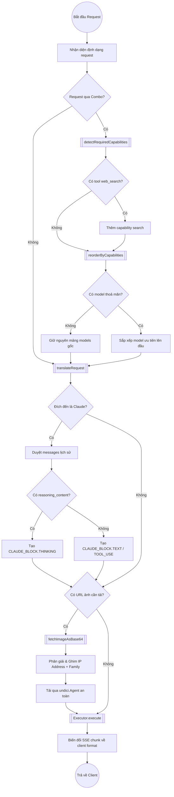
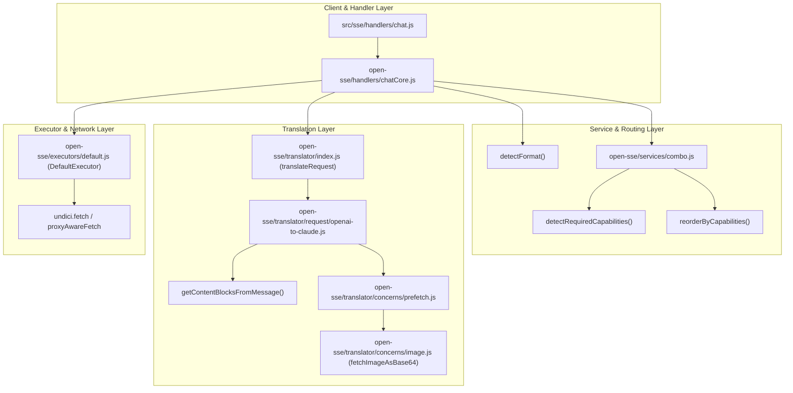

# Tài Liệu Kỹ Thuật: Luồng Xử Lý & Khắc Phục Các Điểm Nghẽn Trong Router & Translator (9Router)

Tài liệu giải thích chi tiết luồng xử lý định tuyến (Routing Pipeline), chuyển đổi định dạng (Format Translation) và các giải pháp đã được áp dụng trong 9Router.

---

## 1. Mở đầu — Vấn đề (Problem Statement)

**Tại sao cần các bước xử lý và sửa lỗi này?**
- **Đồng bộ ngữ cảnh suy luận (Reasoning Context Loss)**: Khi chuyển đổi từ định dạng OpenAI sang Anthropic Claude, thuộc tính `reasoning_content` (chứa chuỗi suy luận của các mô hình DeepSeek R1, Qwen Reasoning) bị bỏ qua, làm đứt đoạn suy nghĩ của mô hình ở các lượt hội thoại kế tiếp.
- **Tối ưu hóa Combo Routing (Capabilities Autoswitch)**: Khi người dùng gửi yêu cầu có kèm công cụ tìm kiếm web (`web_search`), bộ điều phối Combo không kích hoạt tính năng tự chọn mô hình hỗ trợ tìm kiếm. Đồng thời việc tái sắp xếp danh sách mô hình làm mất định danh tham chiếu mảng ban đầu (`Array Reference`).
- **An toàn mạng & DNS Pinning (SSRF Protection & Undici Dispatcher)**: Cơ chế tải trước ảnh chống SSRF yêu cầu kiểm soát chặt chẽ IP ghim (`pinnedIps`), nếu thiếu thông tin IP Family (`IPv4/IPv6`) thì thư viện `undici.Agent` ném ngoại lệ dẫn đến ảnh bị `null`.
- **Đồng bộ cấu hình Mocking Test (Headroom Proxy)**: Luồng kiểm tra ép stream (`forceStream`) thiếu các hàm tiện ích log kích thước Headroom khiến hệ thống kiểm thử Vitest bị ngắt quãng.

---

## 2. Chi Tiết Từng Bước Xử Lý (Step-by-Step Implementation)

### Bước 1: Bảo toàn `reasoning_content` từ OpenAI sang Claude
Khi dịch tin nhắn vai trò `assistant`, kiểm tra sự tồn tại của chuỗi `reasoning_content` và bọc lại vào block `{ type: "thinking", thinking: ... }` chuẩn của Claude.

```javascript
// open-sse/translator/request/openai-to-claude.js:255-263
} else if (msg.role === ROLE.ASSISTANT) {
  if (typeof msg.reasoning_content === "string" && msg.reasoning_content) {
    blocks.push({
      type: CLAUDE_BLOCK.THINKING,
      thinking: msg.reasoning_content
    });
  }

  if (Array.isArray(msg.content)) {
    // Xử lý các content block tiếp theo...
```

**Bảng chuyển đổi (Input → Mapping → Output):**
| Input (OpenAI Format) | Mapping Rule | Output (Claude Messages Format) |
|---|---|---|
| `{ role: "assistant", reasoning_content: "Step 1...", content: "Hello" }` | `reasoning_content` → `CLAUDE_BLOCK.THINKING` | `{ role: "assistant", content: [{ type: "thinking", thinking: "Step 1..." }, { type: "text", text: "Hello" }] }` |

---

### Bước 2: Phát hiện `web_search` & Giữ nguyên tham chiếu khi không có Model phù hợp
1. Bổ sung việc quét danh sách `tools` trong payload để bật cờ capability `search`.
2. Khi không có bất kỳ model nào trong danh sách đạt yêu cầu (`hasMatch === false`), trả về trực tiếp mảng `models` gốc thay vì tạo mảng mới.

```javascript
// open-sse/services/combo.js:77-85
  const items = models.map((m, i) => ({ m, i, t: tierOf(m) }));
  const hasMatch = items.some((item) => item.t < 2);
  if (!hasMatch) return models;

  // Stable sort by tier (Array.prototype.sort is stable in modern engines).
  return items
    .sort((a, b) => a.t - b.t || a.i - b.i)
    .map((x) => x.m);
```

```javascript
// open-sse/services/combo.js:184-192
  // search: check if web search tool is requested
  if (Array.isArray(body.tools)) {
    for (const tool of body.tools) {
      if (tool?.type === "web_search" || tool?.function?.name === "web_search") {
        required.add("search");
      }
    }
  }

  return required;
```

---

### Bước 3: Hoàn thiện ghim địa chỉ IP & DNS Lookup trong tải ảnh an toàn
Khi tạo `undici.Agent` để ghim địa chỉ IP kết nối thực tế nhằm chống DNS Rebinding / SSRF, tự động gán fallback cho `family` (IPv4: 4, IPv6: 6) nếu cấu trúc DNS trả về bị thiếu trường này.

```javascript
// open-sse/translator/concerns/image.js:91-94
  const family = pinnedIps[0].family || (pinnedIps[0].address?.includes(":") ? 6 : 4);
  const dispatcher = new Agent({
    connect: { lookup: (_h, _o, cb) => cb(null, [{ address: pinnedIps[0].address, family }]) },
  });
```

---

### Bước 4: Khắc phục Mock Headroom trong kiểm thử Vitest
Bổ sung các hàm mock `formatHeadroomSizeLog` và `isHeadroomPhantomSavings` vào suite kiểm thử `force-stream-config.test.js`.

```javascript
// tests/unit/force-stream-config.test.js:71-76
vi.mock("../../open-sse/rtk/headroom.js", () => ({
  compressWithHeadroom: vi.fn(async () => null),
  formatHeadroomLog: vi.fn(() => ""),
  formatHeadroomSizeLog: vi.fn(() => ""),
  isHeadroomPhantomSavings: vi.fn(() => false),
}));
```

---

## 3. Flowchart — Sơ Đồ Xử Lý Logic



---

## 4. CallGraph — Sơ Đồ Quan Hệ Hàm



---

## 5. Ví Dụ Hình Dung (Analogy)

Hãy hình dung hệ thống như một **Trung tâm Dịch thuật và Giao nhận Quốc tế**:

1. **Khắc phục `reasoning_content` (Ghi chú tư duy của chuyên gia)**:
   - *Tình huống*: Chuyên gia nước A viết một bức thư kèm theo các tờ giấy nháp ghi lại suy luận logic trước khi đưa ra kết luận.
   - *Trước khi sửa*: Người phiên dịch vứt bỏ toàn bộ giấy nháp, chỉ dịch kết luận cuối. Chuyên gia nước B nhận được thư không hiểu tại sao có kết luận đó.
   - *Sau khi sửa*: Người phiên dịch đóng dấu "Tư duy / Thinking Block" và kẹp toàn bộ giấy nháp vào hồ sơ chuyển giao.

2. **Khắc phục `reorderByCapabilities` (Chọn xe vận chuyển phù hợp)**:
   - *Tình huống*: Đơn hàng cần xe có thiết bị giữ lạnh (`vision`/`search`).
   - *Trước khi sửa*: Nếu bãi xe không có xe giữ lạnh nào, điều phối viên vẫn xáo trộn lại toàn bộ danh sách xe và cấp một bản đăng ký mới.
   - *Sau khi sửa*: Nếu không có xe chuyên dụng, giữ nguyên thứ tự ưu tiên của hợp đồng ban đầu không thay đổi.

3. **Khắc phục `fetchImageAsBase64` (Kiểm tra an ninh bưu kiện ảnh)**:
   - *Tình huống*: Có người gửi một bưu phẩm ảnh từ bên ngoài vào.
   - *Xử lý*: Nhân viên an ninh xác minh đúng số nhà và loại đường dẫn (IPv4/IPv6), khóa đúng tuyến đường để tránh tài xế giao hàng bị chuyển hướng sang địa chỉ nội bộ nhạy cảm.

---

## 6. Bảng Mapping Source Code

| File | Dòng | Vai trò |
|---|---|---|
| `../../open-sse/translator/request/openai-to-claude.js` | 255–263 | Chuyển đổi `reasoning_content` của OpenAI thành khối `thinking` của Claude |
| `../../open-sse/services/combo.js` | 77–85 | Giữ nguyên mảng `models` khi không có model nào thoả mãn capability |
| `../../open-sse/services/combo.js` | 184–192 | Quét tool `web_search` để kích hoạt cờ capability `search` |
| `../../open-sse/translator/concerns/image.js` | 91–94 | Fallback `family` cho IP kết nối trong `undici.Agent` chống SSRF |
| `../../tests/unit/image-fetch-hardening.test.js` | 23–27 | Cập nhật mock DNS chuẩn định dạng mảng địa chỉ IP kèm `family: 4` |
| `../../tests/unit/force-stream-config.test.js` | 71–76 | Bổ sung mock functions cho Headroom logging trong Vitest |
